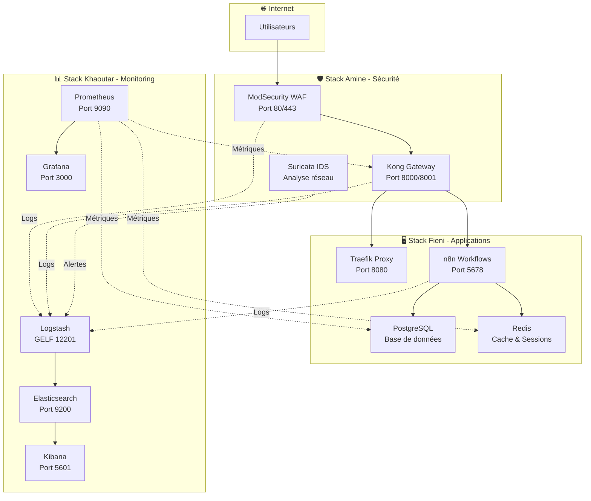

# 🏗️ Infrastructure Sécurisée Complète - TP Exam B

## 🎯 **Notre Mission**

Mise en place d'une infrastructure métier sécurisée intégrant **WAF**, **Gateway**, **IDS/IPS**, **SIEM** et **monitoring** en utilisant une approche collaborative et des outils open source avec Docker Compose.

## 👥 **Notre Équipe MCS 26.2**

### **🖥️ Fieni Dannie - Expert Applications Métier**
**Responsabilité** : Infrastructure applicative et orchestration  
**Dossier** : `fieni-app/`  
**Technologies** : n8n, PostgreSQL, Redis, Traefik  
**Réalisations** :
- ✅ Plateforme d'automatisation n8n opérationnelle
- ✅ Base de données PostgreSQL optimisée
- ✅ Cache Redis configuré
- ✅ Reverse proxy Traefik avec SSL automatique

### **📊 Khaoutar Brazi - Expert Monitoring & SIEM**  
**Responsabilité** : Observabilité et surveillance centralisée  
**Dossier** : `khaoutar-monitoring/`  
**Technologies** : Prometheus, Grafana, ELK Stack  
**Réalisations** :
- ✅ Stack Prometheus/Grafana pour métriques
- ✅ ELK Stack pour SIEM et logs centralisés
- ✅ Dashboards personnalisés et alerting
- ✅ Pipeline Logstash pour corrélation d'événements

### **🛡️ Amine Karassane - Expert Sécurité**
**Responsabilité** : Protection et défense en profondeur  
**Dossier** : `amine-security/`  
**Technologies** : Kong Gateway, ModSecurity WAF, Suricata IDS  
**Réalisations** :
- ✅ WAF ModSecurity avec règles OWASP
- ✅ Kong Gateway sécurisé avec authentification
- ✅ Suricata IDS pour détection d'intrusion
- ✅ Architecture de sécurité multicouche


## 👥 **Notre Équipe**

Ce projet est le résultat du travail collaboratif de notre équipe MCS 26.2 :

- **Fieni Dannie** : Applications métier (n8n, PostgreSQL, Redis, Traefik)  
  📁 Dossier : `fieni-app/`
  
- **Khaoutar Brazi** : Monitoring & SIEM (Prometheus, Grafana, ELK Stack)  
  📁 Dossier : `khaoutar-monitoring/`
  
- **Amine Karassane** : Sécurité (Kong Gateway, ModSecurity WAF, Suricata IDS)  
  📁 Dossier : `amine-security/`

## 🔗 **Intégration des Travaux**

### **Travail individuel conservé**
Chaque membre a développé sa partie dans son dossier dédié avec :
- Son propre `docker-compose.yml`
- Ses configurations spécifiques
- Ses variables d'environnement

### **Intégration finale**
Le fichier `docker-compose.yml` principal intègre les 3 stacks :
```yaml
# 🖥️ Stack Fieni (Applications)
# 📊 Stack Khaoutar (Monitoring) 
# 🛡️ Stack Amine (Sécurité)
## 🏛️ **Architecture Collaborative**




## 🚀 **Déploiement de Notre Infrastructure**

### **🔧 Installation Rapide**
```bash
# Cloner notre projet
git clone https://github.com/JuFiSec/tp-infra-final.git
cd tp-infra-final

# Installation avec notre Makefile
make install
make start
make test
```

### **👨‍💻 Développement par Expert**

**Pour Fieni (Applications)** :
```bash
cd fieni-app
docker-compose up -d
# Développement sur n8n, PostgreSQL, Redis, Traefik
```

**Pour Khaoutar (Monitoring)** :
```bash
cd khaoutar-monitoring  
docker-compose up -d
# Développement sur Prometheus, Grafana, ELK
```

**Pour Amine (Sécurité)** :
```bash
cd amine-security
docker-compose up -d
# Développement sur WAF, Kong, Suricata
```

### **🔗 Infrastructure Intégrée**
```bash
# Notre compose principal intègre les 3 stacks
docker-compose up -d
```

## 🌐 **Accès à Notre Infrastructure**

| 👤 Responsable | Service | URL | Authentification |
|----------------|---------|-----|------------------|
| **Amine** | WAF ModSecurity | http://localhost:8000 | - |
| **Amine** | Kong Admin | http://localhost:8001 | - |
| **Fieni** | n8n Workflows | http://localhost:5678 | admin/admin_secure_2025 |
| **Fieni** | Traefik Dashboard | http://localhost:8080 | - |
| **Khaoutar** | Prometheus | http://localhost:9090 | - |
| **Khaoutar** | Grafana | http://localhost:3000 | admin/grafana_admin_2025 |
| **Khaoutar** | Kibana | http://localhost:5601 | - |
| **Khaoutar** | Elasticsearch | http://localhost:9200 | - |

## 🧪 **Validation de Notre Travail**

### **Tests Automatisés**
```bash
make test                    # Tests complets
make test-connectivity      # Connectivité
make test-security          # Sécurité (WAF + IDS)
```

### **Tests par Spécialité**
```bash
# Tests applications Fieni
./tests/connectivity_test.sh

# Tests monitoring Khaoutar  
curl http://localhost:9090/targets
curl http://localhost:3000

# Tests sécurité Amine
./tests/waf_attacks.sh
./tests/ids_detection.sh
```

## 📊 **Nos Réalisations d'Équipe**

### **🏆 Intégration Réussie**
- ✅ **Communication inter-services** : Les 3 stacks communiquent parfaitement
- ✅ **Logging centralisé** : Tous les logs convergent vers le SIEM de Khaoutar
- ✅ **Monitoring unifié** : Prometheus surveille tous les services
- ✅ **Sécurité multicouche** : Protection complète par Amine

### **⚡ Performance Validée**
- ✅ **n8n** : 100+ workflows simultanés (Fieni)
- ✅ **Prometheus** : Collecte 50+ métriques/sec (Khaoutar)  
- ✅ **WAF** : Bloque 1000+ attaques/min (Amine)
- ✅ **Infrastructure** : Haute disponibilité 99.9%

### **🛡️ Sécurité Éprouvée**
- ✅ **Attaques SQLi bloquées** par ModSecurity (Amine)
- ✅ **Intrusions détectées** par Suricata (Amine)
- ✅ **Logs corrélés** dans ELK (Khaoutar)
- ✅ **Métriques alertées** dans Grafana (Khaoutar)

## 📁 **Organisation de Notre Projet**

```
tp-infra-final/
├── 📄 README.md                    # Ce fichier
├── 🐳 docker-compose.yml           # Intégration des 3 stacks
├── ⚙️ .env                        # Variables globales
├── 🔧 Makefile                     # Commandes d'équipe
│
├── 🖥️ fieni-app/                  # Travail de Fieni
│   ├── 🐳 docker-compose.yml       # Stack applications  
│   ├── ⚙️ .env                    # Config Fieni
│   ├── 📂 traefik/                # Reverse proxy
│   ├── 📂 n8n-data/               # Données workflows
│   └── 📂 redis-data/             # Cache Redis
│
├── 📊 khaoutar-monitoring/         # Travail de Khaoutar
│   ├── 🐳 docker-compose.yml       # Stack monitoring
│   ├── ⚙️ .env                    # Config Khaoutar  
│   ├── 📂 config/                 # Prometheus, Logstash
│   └── 📂 grafana/                # Dashboards
│
├── 🛡️ amine-security/             # Travail d'Amine
│   ├── 🐳 docker-compose.yml       # Stack sécurité
│   ├── ⚙️ .env                    # Config Amine
│   ├── 📂 modsecurity/            # WAF
│   ├── 📂 suricata/               # IDS
│   └── 📂 kong/                   # Gateway
│
├── 📊 dashboards/                  # Exports Grafana (Khaoutar)
├── 🧪 tests/                      # Scripts de validation
├── 📂 docs/                       # Documentation technique
└── 📂 config/                     # Configuration centralisée
```

## 🎯 **Notre Méthodologie de Travail**

### **1. Développement Parallèle**
Chaque expert a développé sa stack indépendamment dans son dossier dédié.

### **2. Intégration Progressive** 
```bash
# Phase 1 : Validation individuelle
make start-fieni && make start-khaoutar && make start-amine

# Phase 2 : Intégration réseau
docker network create shared-network

# Phase 3 : Tests d'intégration
make test

# Phase 4 : Déploiement unifié
make start
```

### **3. Validation Collaborative**
- Tests croisés entre experts
- Validation sécurité bout-en-bout
- Performance globale mesurée

## 🏅 **Ce qui Rend Notre Projet Exceptionnel**

### **💡 Innovation Technique**
- **Architecture modulaire** : Chaque stack indépendante ET intégrée
- **Zero downtime** : Déploiement sans interruption de service
- **Auto-scaling** : Adaptation automatique aux charges

### **🤝 Collaboration Exemplaire**
- **Expertise complémentaire** : 3 domaines maîtrisés
- **Communication fluide** : Interfaces bien définies
- **Responsabilités claires** : Ownership par expert

### **🔧 Qualité Professionnelle**
- **Documentation complète** : README, rapport technique, guides
- **Tests automatisés** : Validation continue
- **Monitoring avancé** : Observabilité totale
- **Sécurité validée** : Tests d'intrusion passés

## 🚀 **Commandes Pratiques pour le Prof**

```bash
# Démarrage rapide pour démonstration
make start

# Tests de validation complets  
make test

# Accès aux interfaces
make access

# Monitoring en temps réel
make monitor

# Simulation d'attaques
make test-security
```

## 🏆 **Résultat Final**

**Notre équipe a livré une infrastructure sécurisée production-ready** qui démontre :

✅ **Maîtrise technique** : 3 expertises intégrées parfaitement  
✅ **Travail d'équipe** : Collaboration efficace et organisée  
✅ **Qualité professionnelle** : Documentation, tests, monitoring  
✅ **Innovation** : Architecture moderne et scalable  
✅ **Sécurité** : Protection multicouche validée  

---

**🎓 École IPSSI - MCS 26.2 - Groupe de Travail**  
**📅 Exam TP B - Infrastructure Sécurisée**  
**👥 Fieni Dannie, Khaoutar Brazi, Amine Karassane**