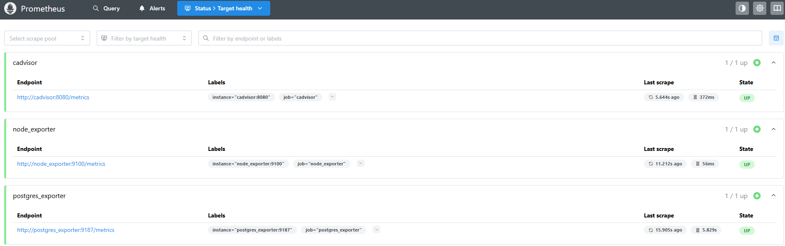
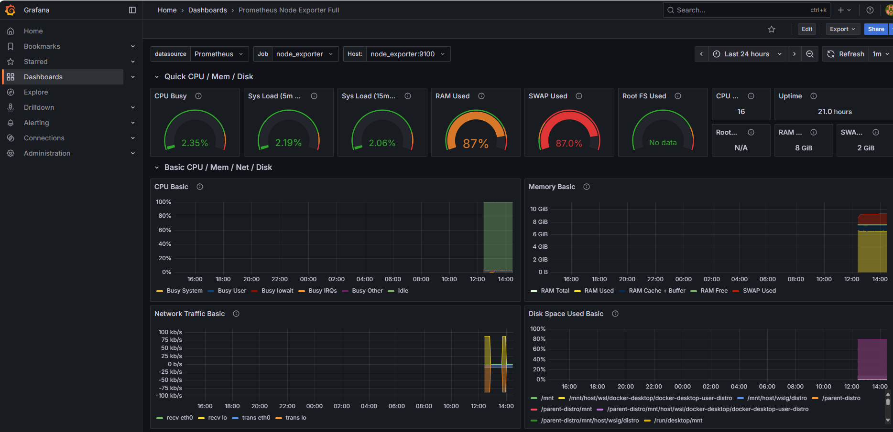
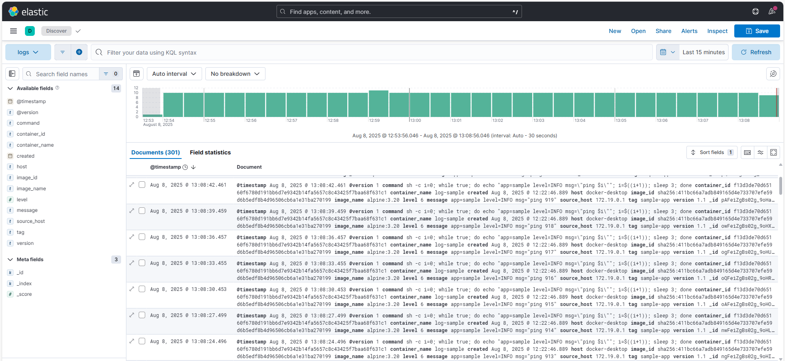

# tp-infra-monitoring-siem
# Monitoring & SIEM – Infrastructure Sécurisée

## Objectif
Mettre en place la partie **monitoring** et **observabilité** du projet, ainsi qu’un **SIEM** (ELK Stack) pour centraliser et analyser les logs.  
L’idée est de collecter à la fois :
- des **métriques** techniques (CPU, mémoire, usage containers, DB…)
- des **logs** applicatifs et de sécurité (WAF, IDS, applicatif)

---

## Architecture mise en place

```text
+---------------------+       +-------------------+
|    Services App     |-----> |   Logstash (GELF)  |----+
| (n8n, Postgres, ...) |       +-------------------+    |
|  logging: gelf       |                               |
+---------------------+                               v
                                                       Elasticsearch --> Kibana (UI)
Prometheus  <---- Exporters (cAdvisor, node, postgres, redis)  
  |  
  v  
Grafana (dashboards)
```

**Réseaux Docker** :
- `monitoring` → pour Prometheus, Grafana, ELK
- `backend` → pour relier les exporters aux apps (Postgres, Redis…)

---

## Services déployés

### Monitoring (Prometheus + Grafana)
- **Prometheus** : collecte des métriques depuis :
  - `node_exporter` → métriques système
  - `cadvisor` → métriques containers
  - `postgres_exporter` → métriques DB PostgreSQL
  - `redis_exporter` → métriques Redis
- **Grafana** :
  - Provisionné avec une datasource Prometheus (`datasource.yml`)
  - Dashboards préconfigurés pour afficher CPU/RAM containers, état exporters, stats DB/cache

### SIEM (ELK Stack)
- **Logstash** :
  - Input : driver Docker **GELF** (`udp://logstash:12201`)
  - Output : Elasticsearch (`logs-YYYY.MM.dd`)
- **Elasticsearch** : stockage des logs
- **Kibana** :
  - Data View `logs-*` pour lire les événements
  - Filtres possibles par service (`tag:"n8n"`, `tag:"waf"`, `tag:"ids"`)

---

## Bonnes pratiques appliquées
- Variables sensibles (user/pass Grafana, creds DB) dans `.env`
- Volumes nommés pour persister :
  - données Grafana (`grafana_data`)
  - index Elasticsearch (`es_data`)
  - données Kibana (`kibana_data`)
- Réseaux séparés pour limiter l’exposition
- Ports uniquement ouverts en local pour les outils d’admin (Grafana 3000, Kibana 5601…)

---

##  Tests de fonctionnement

### 1. Vérification des métriques (Prometheus)
- URL : `http://localhost:9090/targets`  
- 
  → Tous les jobs `UP` (cadvisor, node_exporter, postgres_exporter, redis_exporter)

### 2. Dashboards Grafana
- URL : `http://localhost:3000`  
- 
  - Datasource Prometheus OK (`Save & Test`)
  - Dashboard affiche métriques CPU/RAM containers, stats DB/cache

### 3. Vérification des logs (SIEM)
- Envoi d’un log de test :
```bash
docker run --rm   --log-driver gelf   --log-opt gelf-address=udp://host.docker.internal:12201   --log-opt tag=sample-app   alpine echo "hello from GELF"
```
- Dans Kibana :
  - Data View `logs-*`
  - Discover → filtre `tag:"sample-app"` → message visible

---

## Arborescence projet (extrait)
```
/config/
  prometheus/prometheus.yml
  logstash/pipeline/logstash.conf
/grafana/
  provisioning/datasources/datasource.yml
  provisioning/dashboards/dashboards.yml
  dashboards/system_dashboard.json
docker-compose.yml
.env.example
README.md
```

---

## Étapes suivantes (intégration finale)
- Ajouter les services métier (n8n, WAF, IDS) avec `logging: gelf` vers Logstash
- Ajouter leurs métriques dans Prometheus et Grafana

---
